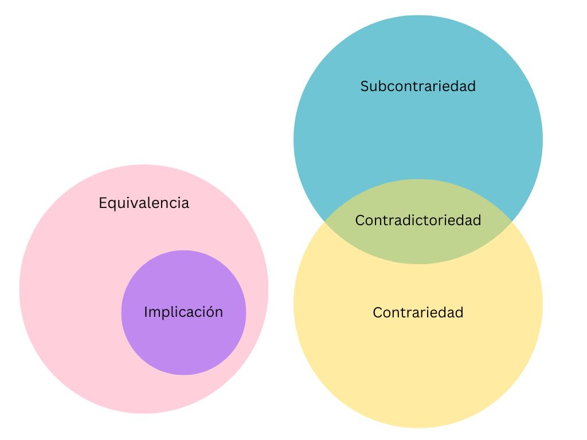

<h1 align="center">Pensamiento Crítico</h1>

Hecho por: Lucio el mejor :)

## Citas Textuales y Conceptos recogidos de algunas clases
- *La lógica es una ciencia **formal** que estudia las estructuras del pensamiento.*
- *Una ciencia debe contener un objeto de estudio, un método y una teoría.*
- *La filosofía no se considera una ciencia porque pretende estudiarlo todo.*
- *Con las ciencias fácticas podemos suponer esa relación causal en un hecho, no así con las ciencias formales.*
- *El cambio es una característica de la realidad.*
- *El pensamiento viene de la mano con el lenguaje.*
- *Un lenguaje artificial surge para analizar un lenguaje natural.*

## Ciencias
| **Formales** | **Fácticas** |
|--------------|---------------|
| Tiene un objeto de estudio ideal | El objeto de estudio es real |
| El método es la deducción, que siempre está sujeto a una hipótesis determinada por axiomas | Utilizan el método empírico, no está sujeto a una hipótesis |
| Lógica, matemática, semántica, etc. | Física, química, psicología, etc. |

---

## Conceptos
### Relación Simétrica
Una relación **simétrica** entre dos elementos **A** y **B** significa que si **A** está relacionado con **B**, entonces **B** también está relacionado con **A**. Por ejemplo, en la relación "ser amigo de", si **A** es amigo de **B**, entonces **B** es amigo de **A**.

### Relación Asimétrica
Una relación **asimétrica** implica que si **A** está relacionado con **B**, entonces **B** no puede estar relacionado con **A**. Un ejemplo sería la relación "ser padre de"; si **A** es padre de **B**, entonces **B** no puede ser padre de **A**.

### Casos de Sustitución
Los **casos de sustitución** se refieren a situaciones en las que se reemplazan variables o elementos en una expresión o proposición sin cambiar su valor lógico. 
en las tablas de verdad los posibles valores de P y Q son casos de sustitución.

## Lógica Proposicional
*Es un lenguaje artificial formado por:*
- Letras esquemáticas (variables).
- Conectivas.
- Signos auxiliares: `() [] {}`.

## Proposiciones
Las proposiciones deben cumplir 3 requisitos:
- Debe ser una oración enunciativa (tener cópula).
- Debe ser una afirmación o una negación.
- Debe poder clasificarse en un valor booleano (verdadero o falso).

Se dividen en:
- Condicional (compleja).
- Disyuntiva (compleja).
- Categórica (simple).

## Conectivas
Con sus respectivas tablas de verdad y símbolos:

### Conjunción (AND) (•) 
***p*** y ***q***

| p   | q   | p • q |
|-----|-----|-------|
| V   | V   | V     |
| V   | F   | F     |
| F   | V   | F     |
| F   | F   | F     |

### Disyunción Inclusiva (OR) (∨) 
***p*** y/o ***q***

| p   | q   | p ∨ q |
|-----|-----|-------|
| V   | V   | V     |
| V   | F   | V     |
| F   | V   | V     |
| F   | F   | F     |

### Disyunción Excluyente (XOR) (w) 
***p*** o ***q***

| p   | q   | p W q |
|-----|-----|-------|
| V   | V   | F     |
| V   | F   | V     |
| F   | V   | V     |
| F   | F   | F     |

También se expresa como: `(A • ~B) ∨ (~A • B)`.

### Negación (NOT) (~) 
***p*** es falso

| p   | ~p  |
|-----|-----|
| V   | F   |
| F   | V   |

### Condicional (⊃) 
Si ***p*** entonces ***q***

| p   | q   | p ⊃ q |
|-----|-----|-------|
| V   | V   | V     |
| V   | F   | F     |
| F   | V   | V     |
| F   | F   | V     |

#### p = Condición Suficiente **(antecedente)**
- "si"
- "es suficiente"
- "alcanza"

#### q = Condición Necesaria **(consecuente)**
- "solo si"
- "es necesario"
- "únicamente"

### Bicondicional (XNOR) (≡) 
***p*** si y solo si ***q***

| p   | q   | p ≡ q |
|-----|-----|-------|
| F   | F   | V     |
| F   | V   | F     |
| V   | F   | F     |
| V   | V   | V     |

También se expresa como: `(A V B) • (~A V ~B)`.

### Incompatible (NAND) (/)

| p   | q   | p / q |
|-----|-----|-------|
| F   | F   | V     |
| F   | V   | V     |
| V   | F   | V     |
| V   | V   | F     |

*"Una tautología es una proposición que siempre da verdadero y una contradicción es una que siempre da falso. Una contingencia puede dar verdadero o falso."*

## Relaciones entre Formas Proposicionales
**Si no sos Lucio, ignorá las relaciones que hice con las compuertas lógicas :p**

### Contrariedad (NAND):
- Dos formas proposicionales son contrarias cuando **no son simultáneamente verdaderas.**
- Relación **simétrica**.

### Subcontrariedad (OR):
- Dos formas proposicionales son subcontrarias cuando **no son simultáneamente falsas.**
- Relación **simétrica**.

### Contradictorias (XOR):
- Dos formas proposicionales son contradictorias cuando **no son simultáneamente verdaderas ni falsas** (son distintas en todos los casos).
- Relación **simétrica**.

### Equivalentes (XNOR):
- Dos formas proposicionales son equivalentes si y solo si **en cada caso tienen el mismo valor** (son iguales en todos los casos).
- Relación **simétrica**.

### Implicación (⊃):
- Una forma proposicional implica a otra si y solo si no ocurre que siendo la primera verdadera, la segunda sea falsa (contraejemplo). Si una forma implica a otra, la segunda se deduce de la primera.
- Relación **asimétrica**.

### Deducción:
- *Una implicación en sentido contrario es una deducción. Si A implica B, entonces B se deduce de A.*
- Relación **asimétrica**.

#### aca dejo un diagrama de venn que se me ocurrió hacer con las relaciones.

## Razonamientos
- **Deductivos** (son válidos):
  - Formales.
  - Lógicos.
- **Inductivos**.
- **Falaces** (son inválidos):
  - Formales.
  - Materiales.

## Expresiones Derivativas
- **Indicadores**: *pues, puesto que, ya que, dado que, porque.*
- **Simbolo de conclusión**: ∴
- **Conclusión**: *por lo tanto, así que, luego, por consiguiente, en consecuencia, por ende, de modo que, de manera que.*
  

## Tipos de Lógica
- **Formal**.
- **Cuantificacional**.
- **Informal** (razonamientos inductivos y falacias materiales).

*Un razonamiento es válido si su forma es válida y una forma válida es aquella en la cual las premisas implican a la conclusión.*

## Prueba de Invalidez (Asignación de Valores)
*Es tratar de demostrar V ∴ F reemplazando las variables. Si el razonamiento supera la prueba de invalidez, significa que es válido, duh...*

1. Reemplazar las variables del consecuente para forzar un valor falso. Si lo logras, ya sabes que el razonamiento no es una tautología.
2. Si da falso, reemplaza las variables en las premisas con los mismos valores que usaste en el consecuente *(no te hagas el vivo)* y trata de forzar un resultado verdadero.
3. Si la expresión da V ∴ F, entonces el razonamiento es inválido.

*Una proposición es inválida cuando las premisas no implican a la conclusión.*

___

**Barra separadora de segundo parcial**

# Álgebra de Boole

## Ley Conmutativa
- **Suma (OR):**  
  `A ∨ B = B ∨ A`
- **Producto (AND):**  
  `A • B = B • A`

## Ley Distributiva
- **Suma sobre producto (OR sobre AND):**  
  `A ∨ (B • C) = (A ∨ B) • (A ∨ C)`
- **Producto sobre suma (AND sobre OR):**  
  `A • (B ∨ C) = (A • B) ∨ (A • C)`

## Ley Asociativa
- **Suma (OR):**  
  `(A ∨ B) ∨ C = A ∨ (B ∨ C)`
- **Producto (AND):**  
  `(A • B) • C = A • (B • C)`

## Ley de Identidad
- **Suma (OR):**  
  `A ∨ 0 = A`
- **Producto (AND):**  
  `A • 1 = A`

## Ley de Anulación
- **Suma (OR):**  
  `A ∨ 1 = 1`
- **Producto (AND):**  
  `A • 0 = 0`

## Ley de Idempotencia
- **Suma (OR):**  
  `A ∨ A = A`
- **Producto (AND):**  
  `A • A = A`

## Ley de Absorción
- **Primera ley:**  
  `A ∨ (A • B) = A`
- **Segunda ley:**  
  `A • (A ∨ B) = A`

## Ley de Complementación
- **Suma (OR):**  
  `A ∨ ~A = 1`
- **Producto (AND):**  
  `A • ~A = 0`

## Ley de Involución
- `~~A = A`

## Leyes de De Morgan
- **Primera ley:**  
  `~(A ∨ B) = ~A • ~B`
- **Segunda ley:**  
  `~(A • B) = ~A ∨ ~B`

## Metavariables
*Variables que contienen expresiones.*  
Por ejemplo, `A = P ∨ Q`.

## Reglas Lógicas
- **Modus Ponens**:  
  `P ⊃ Q, P ∴ Q`
- **Doble Negación**:  
  `!!Q = Q`
- **Silogismo Hipotético**:  
  `(P ⊃ Q) ⊃ R ∴ (P ⊃ R)`
- **Silogismo Disyuntivo**:  
  `P ∨ Q, ¬P ∴ Q`
- **Simplificación**:  
  `P • Q ∴ P`
- **Adición**:  
  `P ∴ P ∨ Q`
